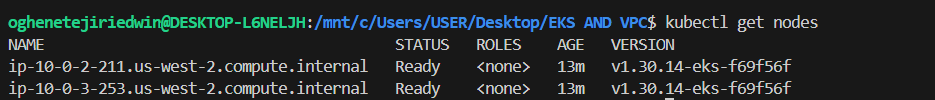

# AWS EKS Cluster with Terraform

Production-grade Kubernetes cluster on AWS using Terraform with remote state management.

## Architecture

- **VPC** with public and private subnets across 3 Availability Zones
- **EKS Cluster** (Kubernetes 1.30) with managed node groups in private subnets
- **NAT Gateways** for outbound internet access from private subnets
- **S3 Backend** for remote Terraform state management
- **IAM Roles** for cluster and node group permissions
```
Internet → Public Subnet (Load Balancer) → Private Subnet (EKS Nodes) → Pods
```

## Prerequisites

### 1. Install AWS CLI
Follow the official docs: https://docs.aws.amazon.com/cli/latest/userguide/install-cliv2.html
```bash
# Verify installation
aws --version
```

### 2. Configure AWS credentials
```bash
aws configure
# Enter your AWS Access Key ID
# Enter your AWS Secret Access Key
# Enter your default region: us-west-2
```

### 3. Install Terraform
Follow the official docs: https://developer.hashicorp.com/terraform/install
```bash
# Verify installation
terraform -version
```

## Project Structure
```
.
├── main.tf                 # Root module - calls vpc and eks modules
├── variables.tf            # Input variables
├── outputs.tf              # Output values
├── modules/
│   ├── vpc/
│   │   ├── main.tf         # VPC, subnets, NAT gateways, route tables
│   │   ├── variables.tf    # VPC input variables
│   │   └── outputs.tf      # VPC outputs (vpc_id, subnet IDs)
│   └── eks/
│       ├── main.tf         # EKS cluster, node groups, IAM roles
│       ├── variables.tf    # EKS input variables
│       └── outputs.tf      # EKS outputs (cluster endpoint, name)
```

## Usage

### 1. Clone the repository
```bash
git clone https://github.com/YOUR_USERNAME/YOUR_REPO_NAME.git
cd YOUR_REPO_NAME
```

### 2. Create S3 bucket for remote state
```bash
aws s3api create-bucket \
  --bucket your-unique-tf-state-bucket \
  --region us-west-2 \
  --create-bucket-configuration LocationConstraint=us-west-2
```

### 3. Update backend configuration
Edit `main.tf` and update the S3 bucket name to match yours.

### 4. Initialize Terraform
```bash
terraform init
```

### 5. Review the plan
```bash
terraform plan
```

### 6. Apply
```bash
terraform apply
```
Type `yes` when prompted. This takes **15-20 minutes**.

### 7. Connect to the cluster
```bash
aws eks update-kubeconfig \
  --region us-west-2 \
  --name my-eks-cluster
  
kubectl get nodes
```

### 8. Destroy all resources (to avoid AWS charges)
```bash
terraform destroy
```

## Variables

| Name | Description | Default |
|------|-------------|---------|
| `region` | AWS region | `us-west-2` |
| `cluster_name` | EKS cluster name | `my-eks-cluster` |
| `cluster_version` | Kubernetes version | `1.30` |
| `vpc_cidr` | VPC CIDR block | `10.0.0.0/16` |

## Cluster Nodes

The EKS cluster is running with 2 worker nodes across multiple availability zones:



### Node Details
- **Kubernetes Version:** v1.30.14-eks-f69f56f
- **Status:** Ready
- **Region:** us-west-2

## Costs

Be aware this project provisions billable AWS resources including EKS, NAT Gateways, and EC2 instances. **Always run `terraform destroy` when done to avoid unexpected charges.**
